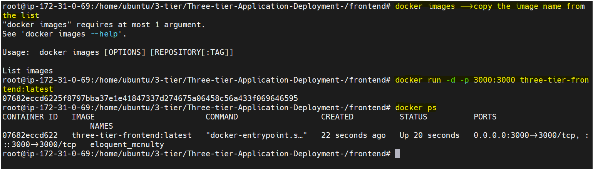
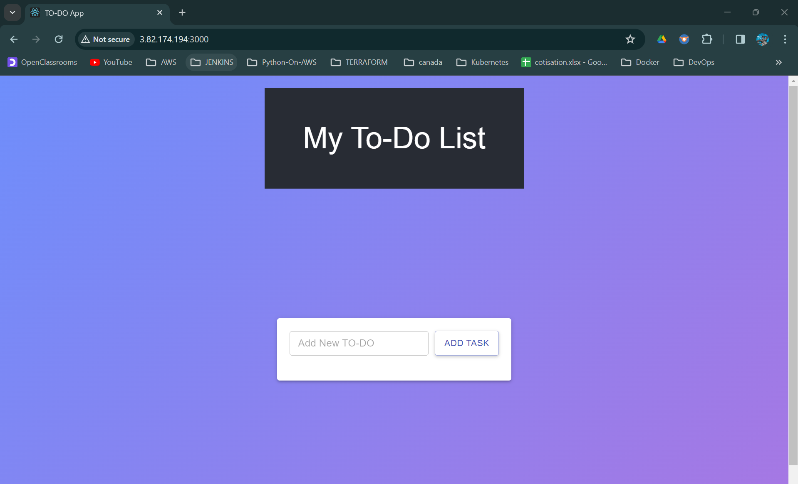
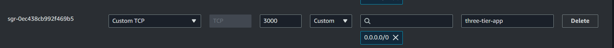
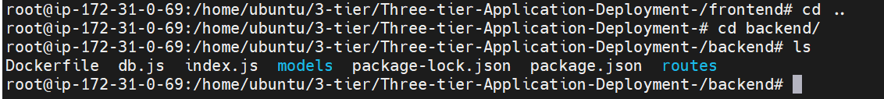
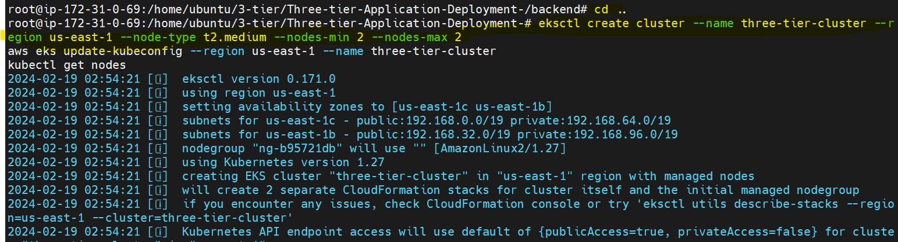

# Threetier-application-deployment-on-Kubernetes


# what do you mean by three tier ?
It’s actually a division of your system in 3 parts

## 1. Presentation Layer (Tier 1):
What you you see when you open your website is called the presentation layer basically it is the layer that users interact directly

## 2. Logical Layer (Tier 2):
Imagine this layer as the brain behind the scenes. It takes the information you provide through the user interface and processes it according to the rules of the system. If it’s a shopping website, for instance, this layer figures out things like the total price of your items, applies discounts, and checks if everything is in stock

## 3. Data Layer (Tier 3):
This is where the data is stored and retrieved. It’s like the memory of the system.
Data could be stored in databases, files, or any other data storage systems.
The data layer is responsible for managing and storing information that the system needs.

# Completion Steps →

### Phase 1 →Setup base EC2 , IAM user and Basic tools on EC2
### Phase 2 →Built frontend and backend images
### Phase 3 → Kubernetes
### Phase 4 →Setup Application Load balancer and ingress
### Phase 5 →Destroy Everything


# Phase 1 →Setup base EC2 , IAM user and Basic tools on EC2
## Step 1. Create an IAM user
1. Don't forget to attach `administratorAcces` policies directly to your iam user


2. `Then click on your IAM user` → 
Security credentials scroll down to access keys and create an access keys. Choose aws cli from the options listed


## Step 2. launching a base EC2 where we do all work →
1. Open your aws console and navigate to ec2 and click on launch ec2 `select ubuntu as your machine image`


2. Click on connect and run the following commands

```
sudo su
```
```
apt update
```
```
mkdir 3-tier
```
```
cd 3-tier
```

3. fetch the code from github by git clone

```
git clone https://github.com/Aakibgithuber/Three-tier-Application-Deployment-.git
```


## Step 3 →Setup aws cli ,docker ,kubectl and eksctl

### 1. Setup aws cli `AWS CLI  is a tool that allows you to interact with AWS services using commands`

Run the following commands to install aws cli

```
snap install aws-cli --classic
```
2. you have to configure aws by the command →

```
aws configure
```
3. It is asked for access key and secret key now you have to open that csv file you downloaded above and copy the access and secret key `Remain everything as it is and click enter`


### 2. Setup docker
Run the following commands. `Don't forget to cd before running this command`

```
apt install docker.io
usermod -aG docker $USER # Replace with your username e.g ‘ubuntu’
newgrp docker
sudo chmod 777 /var/run/docker.sock
```
```
which docker
```


### 3. Setup kubectl
It is a command-line tool used in managing and interacting with Kubernetes clusters

1. To install kubectl run the following commands
```
snap install kubectl --classic
```


### 4. Setup eksctl
It is a command-line tool used for managing Amazon EKS (Elastic Kubernetes Service) clusters.

1. To install eksctl tool run the following commands

```
curl --silent --location "https://github.com/weaveworks/eksctl/releases/latest/download/eksctl_$(uname -s)_amd64.tar.gz" | tar xz -C /tmp
sudo mv /tmp/eksctl /usr/local/bin
eksctl version
```


# Phase 2 →Built frontend and backend images
## Step 1 → setup Elastic container registery (ECR)
It is similiar to dockerhub where we stored the docker images

1. Go to your aws console and search for ECR
2. click on create repository for frontend and set visiblity setting to public. Do same for  backend Repository


## Step 2 →Setup frontend
1. In terminal go to frontend directory and run `ls` command


2. Go to your ecr repo and click on `view push commands`


3. Run the above command one by one to build the frontend image and push to ecr repository


4. Let’s run a container from the image
```
docker images -->copy the image name from the list
```
```
docker run -d -p 3000:3000 three-tier-frontend:latest
```
```
docker ps
```





### your frontend has setup and your application is now running to see your application you could browse →`public-ip:3000`
# `NB` Don't forget to update your Security for the app to run 


## Step 3 →Setup backend
1. Now go to backend directory to setup backend



### Now your backend imge is built successfully and also pushed to Elastic container registery which we used when we create elastic kubernetes service


# Phase 3 Kubernetes
## 1. What is Deployment:
* Imagine a Factory: Think of a deployment as a factory that produces and manages copies of your software applications.
* Multiple Replicas: Just like a factory can produce multiple identical items, a deployment in Kubernetes can create and handle multiple copies (replicas) of your application.
* Easy Updates: If you want to change or update your application, the deployment system can smoothly handle that, like swapping out parts in a factory without stopping production.

## 2. what is Service:

* Imagine a Reception Desk: Picture a service in Kubernetes like a reception desk in a building.
* Central Point of Contact: The service provides a central point of contact for your applications. Instead of trying to find each application directly, other parts of your system can talk to the service, and it knows how to find the right application.
* Stable Address: Just as you have a consistent address for the reception desk, a service has a stable address that other parts of your system can use to communicate with your applications.

## 3. What is Namesapce

* It’s like a labeled section within Kubernetes where you can organize and run your applications. Each namespace is like a fenced-off area where your apps can do their thing without stepping on each other’s toes.
* So, in simpler terms, a namespace in Kubernetes is a way to keep different projects or applications separate and organized, making it easier to manage them in the bustling environment of a Kubernetes cluster

## Step 1 →Setup EKS Cluster and create a namespace
1. Run the following command to setup EKS cluster

```
eksctl create cluster --name three-tier-cluster --region us-east-1 --node-type t2.medium --nodes-min 2 --nodes-max 2
aws eks update-kubeconfig --region us-east-1 --name three-tier-cluster
kubectl get nodes
```

2. It takes 15 to 20 mins to create a cluster



3. on aws console search for aws cloud formation to view the events happening in creation of EKS cluster

4. creating Namesapce from the following command


## Step 2→ create a deployment and service for Frontend
1. go to k8s_manifests directory there you will find deployment and service files for frontend


2. you have to edit the file called frontend-deployment.yaml

3. one thing you need to be changed that is your image name


4. so, go to your ecr repo → select the frontend repo →click on view public listing and copy the image name and paste inside the frontend-deployment.yaml file

Now run the following commands to create the deployment and service for frontend

```
kubectl apply -f frontend-deployment.yaml
```
```
kubectl apply -f frontend-service.yaml
```

## Step 3→ create a deployment and service for Backend
1. In the same folder you will find backend-deployment.yaml and backend-service.yaml
2. you have to edit the file called backend-deployment.yaml
3. one thing you need to be changed that is your image name
4. so, go to your ecr repo → select the backend repo →click on view public listing and copy the image name and paste inside the backend-deployment.yaml file

Now run the following commands to create the deployment and service backend

```
kubectl apply -f backend-deployment.yaml
```
```
kubectl apply -f backend-service.yaml
```
```
kubectl get pods -n workshop
```

# Now our two tier is ready that is frontend and backend let’s setup the third tier

## step 4 →Setup Database tier
1. Locate the mongo folder that stores deployment , service and secrets manifests

2. Run the below commands to setup database tier
```
kubectl apply -f .
```
```
kubectl get all
```
# Now your all three tiers are ready to go but how do you access them for that we have to create a application load balancer to route outside traffic towards cluster and an ingress for in internal routing between our 3 tiers


# Phase 4 →Setup Application Load balancer and ingress
we have to create a application load balancer to route outside traffic towards cluster and an ingress for in internal routing between our 3 tiers

## Step 1 →Setup aws load balancer ; installation and attachement it to your EKS cluster
1. Below command fetch the iam policy for your ALB

```
curl -O https://raw.githubusercontent.com/kubernetes-sigs/aws-load-balancer-controller/v2.5.4/docs/install/iam_policy.json
```

2. This command create the iam policy in your aws account from iam_policy.json file that is setup in the first command

```
aws iam create-policy --policy-name AWSLoadBalancerControllerIAMPolicy --policy-document file://iam_policy.json
```

3. This command apply the load balancer policy to your eks cluster so that your eks cluster is working with your load balancer according to the policy

```
eksctl utils associate-iam-oidc-provider --region=us-east-1 --cluster=three-tier-cluster --approve
```

4. This command create and attach an service account to your cluster so that your cluster is allowed to work with load balancer service

### please change your aws account no. from the below command otherwise it won’t work

```
eksctl create iamserviceaccount --cluster=three-tier-cluster --namespace=kube-system --name=aws-load-balancer-controller --role-name AmazonEKSLoadBalancerControllerRole --attach-policy-arn=arn:aws:iam::767397866747:policy/AWSLoadBalancerControllerIAMPolicy --approve --region=us-east-1
```
### All the policies are attached let’s deploy the load balancer

5. For this we have to install helm→Helm is a special tool that helps you easily carry and manage your software when you’re using Kubernetes, which is like a big playground for running applications.

```
sudo snap install helm --classic
```

6. After this we have to add a particular manifest for load balancer that is pre written by someone on eks repo by using helm

```
helm repo add eks https://aws.github.io/eks-charts
```

7. update the eks repo using helm

```
helm repo update eks
```

8. Install the load balancer controller on your eks cluster

```
helm install aws-load-balancer-controller eks/aws-load-balancer-controller -n kube-system --set clusterName=my-cluster --set serviceAccount.create=false --set serviceAccount.name=aws-load-balancer-controller
kubectl get deployment -n kube-system aws-load-balancer-controller
```

### Now your Load balancer is working let’s setup Ingress for internal routing

## Step 2 →Setup Ingress for internal routing
1. Loacte the full_stack_lb.yaml file

```
kubectl apply -f full_stack_lb.yaml
```
```
kubectl get ing -n workshop
```

2. go to your Web Browser and paste the above dns address

### Congrtas !! Your application is accessible through load balancer ingress


# Phase 5 →Destroy Everything
1. On your current folder run

```
kubectl delete -f .
```

2. go to mongo folder to delete database tier

```
kubectl delete -f .
```

3. Delete the cluster and the stack of your cloud formation

```
eksctl delete cluster --name three-tier-cluster --region us-east-1
aws cloudformation delete-stack --stack-name eksctl-three-tier-cluster-cluster
```

4. you could checkout alll the changes in cloud formation console of aws