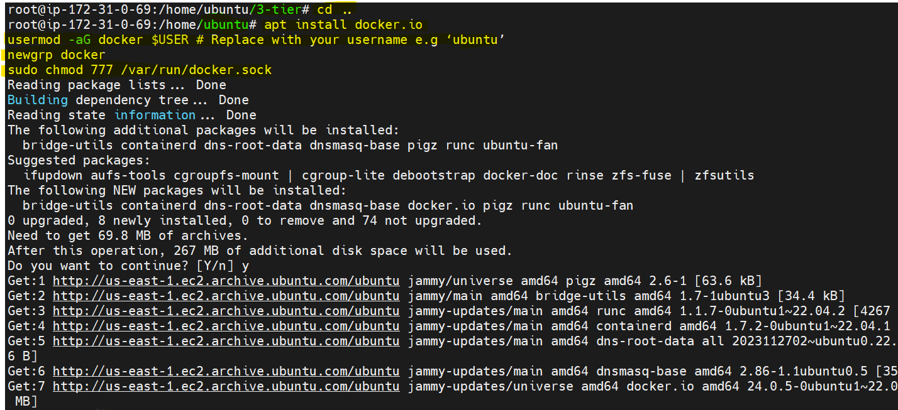

# Threetier-application-deployment-on-Kubernetes


# what do you mean by three tier ?
It’s actually a division of your system in 3 parts

## 1. Presentation Layer (Tier 1):
What you you see when you open your website is called the presentation layer basically it is the layer that users interact directly

## 2. Logical Layer (Tier 2):
Imagine this layer as the brain behind the scenes. It takes the information you provide through the user interface and processes it according to the rules of the system. If it’s a shopping website, for instance, this layer figures out things like the total price of your items, applies discounts, and checks if everything is in stock

## 3. Data Layer (Tier 3):
This is where the data is stored and retrieved. It’s like the memory of the system.
Data could be stored in databases, files, or any other data storage systems.
The data layer is responsible for managing and storing information that the system needs.

# Completion Steps →

### Phase 1 →Setup base EC2 , IAM user and Basic tools on EC2
### Phase 2 →Built frontend and backend images
### Phase 3 → Kubernetes
### Phase 4 →Setup Application Load balancer and ingress
### Phase 5 →Destroy Everything


# Phase 1 →Setup base EC2 , IAM user and Basic tools on EC2
## Step 1. Create an IAM user
1. Don't forget to attach `administratorAcces` policies directly to your iam user


2. `Then click on your IAM user` → 
Security credentials scroll down to access keys and create an access keys. Choose aws cli from the options listed


## Step 2. launching a base EC2 where we do all work →
1. Open your aws console and navigate to ec2 and click on launch ec2 `select ubuntu as your machine image`


2. Click on connect and run the following commands

```
sudo su
```
```
apt update
```
```
mkdir 3-tier
```
```
cd 3-tier
```

3. fetch the code from github by git clone

```
git clone https://github.com/Aakibgithuber/Three-tier-Application-Deployment-.git
```


## Step 3 →Setup aws cli ,docker ,kubectl and eksctl

### 1. Setup aws cli `AWS CLI  is a tool that allows you to interact with AWS services using commands`

Run the following commands to install aws cli

```
snap install aws-cli --classic
```
2. you have to configure aws by the command →

```
aws configure
```
3. It is asked for access key and secret key now you have to open that csv file you downloaded above and copy the access and secret key `Remain everything as it is and click enter`


### 2. Setup docker
Run the following commands. `Don't forget to cd before running this command`

```
apt install docker.io
usermod -aG docker $USER # Replace with your username e.g ‘ubuntu’
newgrp docker
sudo chmod 777 /var/run/docker.sock
```
```
which docker
```



### 3. Setup kubectl
It is a command-line tool used in managing and interacting with Kubernetes clusters

1. To install kubectl run the following commands
```
snap install kubectl --classic
```


### 4. Setup eksctl
It is a command-line tool used for managing Amazon EKS (Elastic Kubernetes Service) clusters.

1. To install eksctl tool run the following commands

```
curl --silent --location "https://github.com/weaveworks/eksctl/releases/latest/download/eksctl_$(uname -s)_amd64.tar.gz" | tar xz -C /tmp
sudo mv /tmp/eksctl /usr/local/bin
eksctl version
```


# Phase 2 →Built frontend and backend images
## Step 1 → setup Elastic container registery (ECR)
It is similiar to dockerhub where we stored the docker images

1. Go to your aws console and search for ECR
2. click on create repository for frontend and set visiblity setting to public. Do same for  backend Repository


## Step 2 →Setup frontend
1. In terminal go to frontend directory and run `ls` command


2. Go to your ecr repo and click on `view push commands`


3. Run the above command one by one to build the frontend image and push to ecr repository
